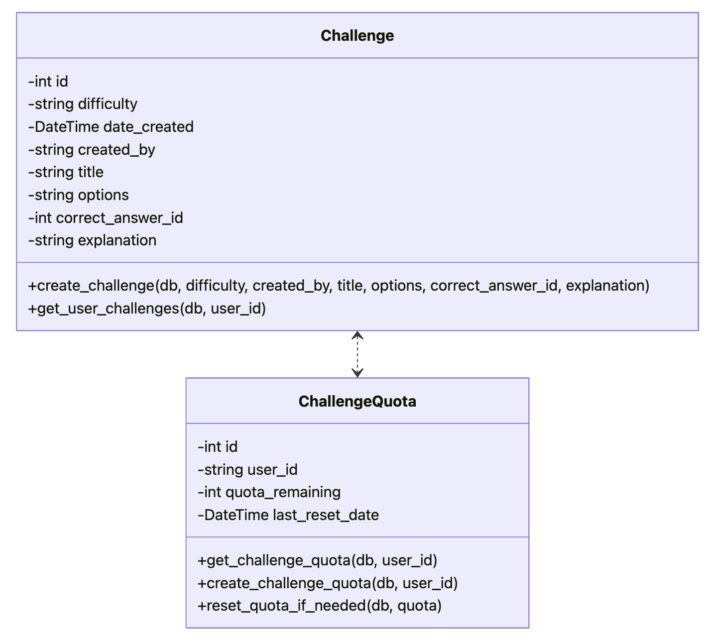

# CodeQuiz Generator

  <!-- Replace with the actual path to your demo GIF -->

**CodeQuiz Generator** is a full-stack web application built with **FastAPI** (backend) and **React** (frontend), featuring **Clerk** for user authentication, and deployed with **Docker**.  

Users can select a question difficulty (**Easy / Medium / Hard**), and the system uses an **LLM** to generate quiz questions dynamically. After answering, users receive **correct/incorrect** feedback with explanations. All solved questions are stored in the user’s **history**, and each user has **50 Challenges remaining per day**.

---

## Quick Start

```bash
# 1. Clone the repository
git clone ***
cd codequiz-generator

# 2. Backend setup
cd backend
# add your own API keys in .env file
uv add fastapi uvicorn sqlalchemy python-dotenv openai clerk-backend-api
uv run ./server.py   # Start the backend server

# 3. Frontend setup (in another terminal)
cd frontend
npm install react-router-dom@6 @clerk/clerk-react
npm run dev          # The frontend will run at http://localhost:5173

# 4. Build and run with Docker Compose
# To deploy the project with Docker:
docker compose up --build
# Frontend: http://localhost/
# Backend API: http://localhost:8000/
```


# UML Diagram




---

## Core Project Flow

1. The user selects a difficulty level and clicks the **"Generate Challenge"** button.  
2. The frontend sends a request with the selected difficulty to the backend route `generate-challenge`.  
3. The backend route `generate-challenge` performs the following steps:  
   - Authenticate the user with Clerk.  
   - Check the user’s quota to ensure it is greater than zero.  
   - Call the `generate_challenge_with_ai` function, which uses the LLM model to generate a new challenge.  
   - Save the new challenge into the database via the `create_challenge` function.  
   - Deduct one quota from the user and commit the transaction.  
   - Return the challenge data to the frontend.


## Questions Learned

### Difference between JSON and Python Dict

- JSON is a pure string and language-independent (Java, JavaScript, Python can all parse it).  
- `json.loads(...)` parses a JSON string into a Python dictionary in memory.  
- `json.dumps(...)` converts a Python dictionary into a JSON string.  

### Purpose of `__init__.py`

- Marks a folder as a Python package.  
- Allows importing modules from the package using implicit namespace imports.  

### Difference between `challenge_data` and `new_challenge`

- `challenge_data` is a Python dictionary, accessed with keys (e.g. `challenge_data["title"]`).  
- `new_challenge` is an instance of the `Challenge` class, accessed with attributes (e.g. `new_challenge.title`).  


# FastAPI Notes

### 1. Routers and Paths


#### Path Parameters
- **Required parameters**, part of the URL itself.  
- Example: in `/items/{item_id}`, the value of `item_id` in the URL is automatically passed to the function argument `item_id`.  

#### Query Parameters
- **Optional parameters**, added to the URL after a `?`.  
- Example: `/items/123?q=search_term` → `q` is a query parameter.  

#### Request Body
- Mainly used in **POST** or **PUT** requests when sending structured data.  
- Typically defined with **Pydantic’s BaseModel**, which ensures validation.  
- Declaring the model as a function parameter allows FastAPI to automatically parse and validate the incoming request body.  

#### Union and Optional Parameters
- `Union[str, None] = None` means the parameter can be either a string or `None`, with `None` as the default.  
- In Python 3.10+, this can be simplified as `q: str | None = None`.  

#### Keyword-Only Arguments
- Using `*` in function definitions forces all parameters that follow to be passed as keyword arguments.  

#### Annotated
- `Annotated` (from `typing.Annotated`) combines a type with extra metadata.  
- Example: `Annotated[int, Body(gt=0)]` → parameter is an integer, comes from the request body, and must be greater than 0.  
- Example: `Annotated[Item, Body(embed=True)]` → request body must contain an object wrapped inside a field named `item`.  


```json
# Without `embed=True`:
{
  "name": "Foo",
  "price": 10
}
# With `embed=True`:
{
  "item": {
    "name": "Foo",
    "price": 10
  }
}
```


DEPENDS


CORS


