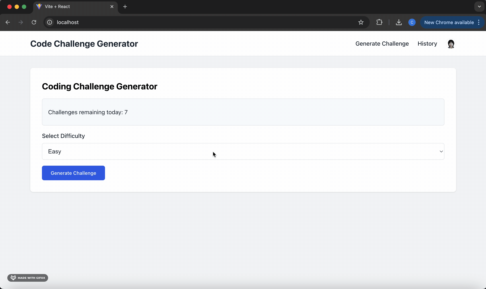

# CodeQuiz Generator

  <!-- Replace with the actual path to your demo GIF -->

**CodeQuiz Generator** is a full-stack web application built with **FastAPI** (backend) and **React** (frontend), featuring **Clerk** for user authentication, and deployed with **Docker**.  

Users can select a question difficulty (**Easy / Medium / Hard**), and the system uses an **LLM** to dynamically generate quiz questions. After answering, users receive **correct/incorrect** feedback with explanations. All solved questions are stored in the user’s **history**, and each user has **50 Challenges remaining per day**.

---

## Quick Start

```bash
# 1. Clone the repository
git clone ***
cd codequiz-generator

# 2. Backend setup
cd backend
# add your own API keys in .env file
uv add fastapi uvicorn sqlalchemy python-dotenv openai clerk-backend-api
uv run ./server.py   # Start the backend server

# 3. Frontend setup (in another terminal)
cd frontend
npm install react-router-dom@6 @clerk/clerk-react
npm run dev          # The frontend will run at http://localhost:5173

# 4. Build and run with Docker Compose
# To deploy the project with Docker:
docker compose up --build
# Frontend: http://localhost/
# Backend API: http://localhost:8000/